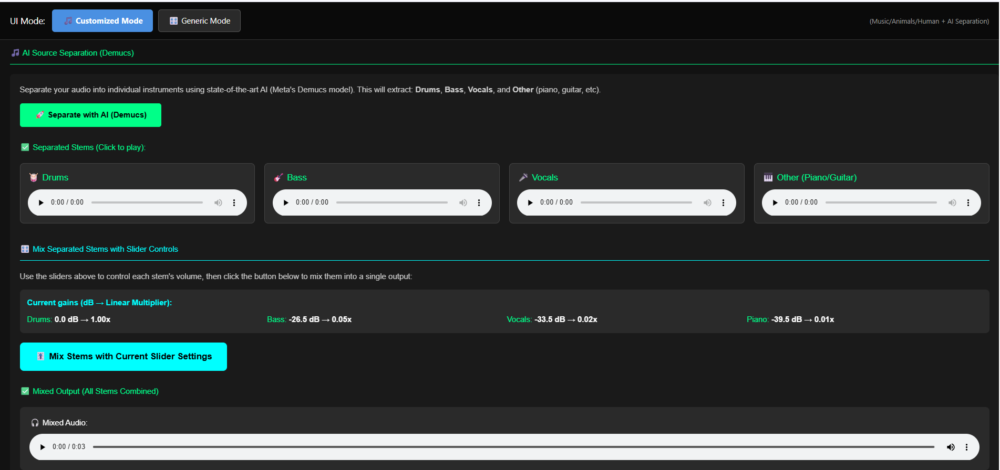

# Signal Equalizer

A comprehensive audio signal processing application featuring advanced equalization, real-time visualization, and AI-powered source separation. Built with React and Python using Fast Fourier Transform (FFT) for signal analysis, this tool provides both generic frequency-based equalization and specialized modes for musical instruments, animal sounds, and human voices.


## 🎯 Features

### Dual Operating Modes

#### **Generic Mode**
Professional frequency-domain equalization with complete signal visualization using FFT:
- **Multi-Domain Visualization**:
  - Time domain waveform analysis
  - Spectrogram representation
  - Linear frequency graph
  - Audiogram display
- **Dynamic Equalizer Sliders** (Generic Mode Only):
  - Add custom sliders at any frequency point
  - Adjust gain with scalar values from 0 to 2
  - Real-time preview on frequency graphs
  - Visual feedback on input/output comparison
- **Live Output Processing**:
  - Instant effect preview in time domain
  - Spectrogram updates reflecting EQ changes
  - Frequency response visualization
  - Export processed audio


#### **Customized Mode**
Specialized source separation and processing with three intelligent presets, each featuring **static frequency sliders with dB gain control**. Musical and Human Voices modes include an **AI-powered separation feature** that allows you to compare results between AI-based source separation and traditional frequency-based filtering.


##### 1️⃣ Musical Instruments Mode
- **AI-Powered Separation**: Automatically separates audio into:
  - Bass (45-230 Hz)
  - Drums (30-260 Hz)
  - Piano (313-620 Hz)
  - Vocals (630-1000 Hz)
- **Static Sliders**: Four pre-configured sliders with dB gain adjustment
- **Individual Control**: Independent gain control for each instrument
- **Smart Mixing**: Remix separated stems with custom balance
- **AI Comparison Feature**: Compare results between:
  - **AI-based separation**: Uses Demucs v3 model for intelligent stem isolation
  - **Frequency-based filtering**: Traditional FFT-based frequency domain separation
- **Workflow**:
  1. Upload your music track
  2. Adjust dB gain sliders for each instrument
  3. Enable AI separation (optional) for advanced stem isolation
  4. Compare AI vs. frequency-based separation results
  5. Process & preview in all visualization modes
  6. Export enhanced audio




##### 2️⃣ Animal Sounds Mode
- **Static Sliders**: Four pre-configured frequency ranges with dB gain control
- **Frequency-Based Separation Only**: Uses FFT-based filtering to isolate animal sounds by frequency range (no AI model)
- Optimized frequency ranges for animal voice detection:
  - Lion: 5.2-210.5 Hz
  - Bird: 4000-5650 Hz
  - Cat: 1212-1600 Hz
  - Dog: 400-1200 Hz
- **Workflow**:
  1. Upload audio containing animal sounds
  2. Adjust dB gain sliders for each animal type
  3. Process & preview in all visualization modes
  4. Export enhanced audio


##### 3️⃣ Human Voices Mode
- **AI Voice Separation**: Isolates up to 4 distinct human voices using MultiDecoderDPRNN model
- **Static Sliders**: Four pre-configured sliders with dB gain adjustment
- **Individual Processing**: Adjust dB gain for each separated voice
- **Advanced Mixing**: Combine processed voices with precise control
- Frequency ranges optimized for human vocal characteristics:
  - Voice 1: 90-450 Hz
  - Voice 2: 460-490 Hz
  - Voice 3: 500-1000 Hz
  - Voice 4: 90-720 Hz
- **AI Comparison Feature**: Compare results between:
  - **AI-based separation**: Uses MultiDecoderDPRNN for intelligent voice isolation
  - **Frequency-based filtering**: Traditional FFT-based frequency domain separation
- **Workflow**:
  1. Upload audio with multiple speakers
  2. Adjust dB gain sliders for each voice
  3. Enable AI voice separation (optional) for advanced isolation
  4. Compare AI vs. frequency-based separation results
  5. Process & preview in all visualization modes
  6. Export enhanced audio


### Universal Features Across All Modes
- **Real-Time Visualization**:
  - Time domain waveforms
  - Linear and logarithmic frequency displays
  - Audiogram representation
  - Spectrogram analysis
- **Input/Output Comparison**: Side-by-side visualization of original and processed signals
- **Multiple Export Formats**: Save processed audio in various formats
- **Preset Management**: Save and load custom equalizer configurations


.png)

## 🏗️ Architecture

### Backend (Python/FastAPI)
- **Signal Processing**: Custom Fast Fourier Transform (FFT) implementation for all frequency analysis
- **AI Models**:
  - Demucs v3 for musical instrument separation
  - MultiDecoderDPRNN for human voice separation
- **Audio I/O**: High-quality audio reading/writing with soundfile
- **API**: RESTful endpoints with FastAPI + Uvicorn

### Frontend (React/Vite)
- **UI Framework**: React 19 with Tailwind CSS
- **Visualization**: Chart.js with zoom/pan capabilities
- **State Management**: React hooks for real-time updates
- **HTTP Client**: Axios for backend communication

## 📋 Prerequisites

- **Python**: 3.8 or higher
- **Node.js**: 16.x or higher
- **FFmpeg**: Required for audio processing (see installation below)
- **Git**: For cloning the repository

## 🚀 Installation

### 1. Clone the Repository
```bash
git clone https://github.com/sbme-tutorials/task-3-signal-equalizer-team-15-2.git
cd Signal-Equalizer
```

### 2. Install FFmpeg

**Windows (Recommended Method):**
Run the provided installation helper:
```powershell
.\install_ffmpeg.ps1
```

**Windows (Manual):**
1. Download from [https://www.gyan.dev/ffmpeg/builds/ffmpeg-release-essentials.zip](https://www.gyan.dev/ffmpeg/builds/ffmpeg-release-essentials.zip)
2. Extract to `C:\ffmpeg`
3. Add `C:\ffmpeg\bin` to your system PATH
4. Restart PowerShell and verify: `ffmpeg -version`

**Windows (Winget):**
```powershell
winget install ffmpeg
```

**macOS:**
```bash
brew install ffmpeg
```

**Linux (Ubuntu/Debian):**
```bash
sudo apt update
sudo apt install ffmpeg
```

### 3. Backend Setup

Navigate to the backend directory:
```bash
cd music-eq-backend
```

Create a virtual environment:
```bash
python -m venv venv
```

Activate the virtual environment:
```powershell
# Windows PowerShell
.\venv\Scripts\Activate.ps1

# Windows CMD
.\venv\Scripts\activate.bat

# macOS/Linux
source venv/bin/activate
```

Install dependencies:
```bash
pip install -r requirements.txt
```

**Note**: The AI models (Demucs and Asteroid) will be downloaded automatically on first use (~500MB total).

### 4. Frontend Setup

Open a new terminal and navigate to the frontend directory:
```bash
cd music-eq-frontend
```

Install dependencies:
```bash
npm install
```

## 🎮 Usage

### Starting the Application

**Terminal 1 - Backend Server:**
```bash
cd music-eq-backend
# Activate your virtual environment first
uvicorn main:app --reload --host 0.0.0.0 --port 8000
```

**Terminal 2 - Frontend Development Server:**
```bash
cd music-eq-frontend
npm run dev
```

The application will be available at: **http://localhost:5173**

### Using Generic Mode

1. **Upload Audio**: Click the upload button and select your audio file (WAV, MP3, FLAC, OGG)
2. **View Input**: Examine the input signal in time domain, frequency domain, and spectrogram
3. **Add Dynamic Sliders**: 
   - Click "Add Slider" to create custom equalizer control points
   - Set the frequency (e.g., 1000 Hz, 2000 Hz, 4000 Hz)
   - Adjust the gain using scalar values (0 to 2, where 1 = no change)
4. **Preview**: Observe slider positions on input/output frequency graphs
5. **Process**: The output updates automatically showing effects in:
   - Time domain waveform
   - Frequency response (FFT-based)
   - Spectrogram
6. **Export**: Download the processed audio file

### Using Customized Mode

The three customized modes have different workflows based on their capabilities:

#### Musical Instruments & Human Voices Modes:
1. **Upload Audio**: Select your audio file containing the relevant sound type
2. **Adjust Static Sliders**: Four pre-configured frequency sliders with dB gain control
3. **Choose Separation Method**: 
   - **Frequency-based filtering**: Traditional FFT-based separation (always available)
   - **AI-based separation** (optional): Advanced stem/voice isolation using deep learning models
4. **Compare Results**: View and compare outputs from both separation methods
5. **Process & Preview**: View results in all visualization modes:
   - Time domain waveform
   - Linear frequency graph
   - Audiogram
   - Spectrogram
6. **Export**: Download the enhanced audio file

#### Animal Sounds Mode:
1. **Upload Audio**: Select audio containing animal sounds
2. **Adjust Static Sliders**: Four pre-configured frequency sliders with dB gain control
3. **Process with FFT**: Uses frequency-based filtering only (no AI model available)
4. **Process & Preview**: View results in all visualization modes:
   - Time domain waveform
   - Linear frequency graph
   - Audiogram
   - Spectrogram
5. **Export**: Download the enhanced audio file

## 📁 Project Structure

```
Signal-Equalizer/
├── music-eq-backend/           # Python FastAPI backend
│   ├── backend/
│   │   ├── equalizer_core.py   # Core EQ processing
│   │   ├── fft_implementation.py # Custom FFT algorithms
│   │   ├── signal_io.py        # Audio I/O handlers
│   │   ├── demucs_integration.py # Music separation
│   │   └── human_separation.py  # Voice separation
│   ├── models/                 # AI model storage
│   ├── uploads/                # Temporary upload storage
│   ├── outputs/                # Processed audio files
│   ├── configs/                # Saved EQ configurations
│   ├── main.py                 # FastAPI application
│   ├── modes_config.json       # Mode definitions
│   └── requirements.txt        # Python dependencies
│
├── music-eq-frontend/          # React frontend
│   ├── src/
│   │   ├── components/         # React components
│   │   ├── hooks/              # Custom React hooks
│   │   └── utils/              # Utility functions
│   ├── public/                 # Static assets
│   └── package.json            # Node dependencies
│
└── install_ffmpeg.ps1          # FFmpeg installation helper
```

## 🔧 Troubleshooting

### FFmpeg Not Found
**Error**: `ffmpeg: command not found` or similar
**Solution**: 
- Verify installation: `ffmpeg -version`
- Run `install_ffmpeg.ps1` (Windows)
- Ensure FFmpeg is in your system PATH
- Restart your terminal/PowerShell after installation

### Backend Port Already in Use
**Error**: `Address already in use: 8000`
**Solution**: 
```bash
# Use a different port
uvicorn main:app --reload --port 8001
```

### AI Models Download Issues
**Error**: Model download fails or times out
**Solution**:
- Ensure stable internet connection
- Models are cached in `~/.cache/torch/hub/` (Linux/Mac) or `%USERPROFILE%\.cache\torch\hub\` (Windows)
- Manually download if needed and place in appropriate directory
- Check disk space (requires ~500MB)

### Memory Issues with Large Files
**Error**: Out of memory when processing large audio files
**Solution**:
- Process shorter audio segments
- Close other applications
- Increase virtual memory/swap space
- Consider using a machine with more RAM (8GB+ recommended)

### CORS Issues
**Error**: Frontend cannot connect to backend
**Solution**:
- Ensure backend is running on `http://localhost:8000`
- Check browser console for specific errors
- Verify no firewall is blocking local connections

## 🧪 API Endpoints

### Audio Processing
- `POST /upload` - Upload audio file
- `POST /process` - Apply equalization
- `POST /separate` - AI source separation
- `GET /download/{filename}` - Download processed audio

### Configuration
- `POST /save-config` - Save equalizer preset
- `GET /load-config/{name}` - Load saved preset
- `GET /modes` - Get available modes and frequency ranges

## 🛠️ Development

### Running Tests
```bash
cd music-eq-backend
pytest
```

### Building for Production

**Frontend:**
```bash
cd music-eq-frontend
npm run build
```

**Backend:**
```bash
# Production server (use gunicorn for better performance)
pip install gunicorn
gunicorn main:app --workers 4 --worker-class uvicorn.workers.UvicornWorker --bind 0.0.0.0:8000
```

## 📊 Technical Specifications

- **Supported Audio Formats**: WAV, MP3, FLAC, OGG, M4A
- **Sample Rates**: 8kHz - 192kHz (automatically resampled)
- **Bit Depths**: 16-bit, 24-bit, 32-bit float
- **Max File Size**: 100MB (configurable)
- **Processing Latency**: < 2s for 3-minute audio (hardware dependent)
- **AI Model Accuracy**: ~90% source separation quality (SDR metric)

## 🤝 Contributing

This is an academic project for DSP course (Task 3). Contributions, bug reports, and feature requests are welcome!

## 👥 Team

**Developed by:**
- Zeyad Ashraf
- Ekram Ahmed
- Alaa Mubarak
- Rahma Fathy

**Under the supervision of:**  
Dr. Tamer El-Basha

Systems and Biomedical Engineering Department

## 🙏 Acknowledgments

- **Demucs**: Facebook Research - Music source separation
- **Asteroid**: INRIA - Speech separation toolkit
- **Chart.js**: Data visualization library
- **FastAPI**: Modern Python web framework
- **React**: Facebook - UI framework

---

**Project Repository**: [https://github.com/ZEY0D/Signal-Equalizer.git](https://github.com/ZEY0D/Signal-Equalizer.git)

**Course**: Digital Signal Processing (DSP)  
**Institution**: Systems and Biomedical Engineering Department  
**Academic Year**: 2024-2025
